<!-- README.md is generated from README.Rmd. Please edit that file -->

# Welcome to `SoundShape`

[](https://zenodo.org/badge/latestdoi/298667332)

Here, you will find information on how to implement a promising, and yet
little explored method for biacoustical analysis: the so called
*eigensound* analysis developed by [MacLeod, Krieger and Jones
(2013)](https://doi.org/10.4404/hystrix-24.1-6299) and expanded by
[Rocha & Romano (2021)](https://doi.org/10.1111/2041-210X.13580).

Eigensound is a multidisciplinary method focused on the direct
comparison between homologous sounds from different species (*i.e.*
stereotyped calls/acoustic units; Macleod *et al.*, 2013; Rocha &
Romano, 2021). It consists on applying a sampling grid over the
representation of sound (*i.e.* spectrogram data; Figs. 1 and 2) and
then translate the spectrogram into a dataset that can be analyzed
similarly to coordinate sets used in Geometric Morphometrics Methods
(GMM). By doing so, eigensound crosses the bridge between Bioacoustics
and GMM.

Despite being well described by Macleod *et al.* (2013), the method
lacked a free and open platform to run the analysis. `SoundShape`
package was written on [R platform](https://www.r-project.org/) to fill
this applicability gap. The package features functions that enable
anyone familiar with `R` to easily go from sound waves to principal
components analysis (PCA), using tools extracted from traditional
bioacoustics (*i.e.* [tuneR](https://CRAN.R-project.org/package=tuneR)
and [seewave](https://CRAN.R-project.org/package=seewave) packages),
geometric morphometrics (*i.e.*
[geomorph](https://CRAN.R-project.org/package=geomorph) package) and
multivariate analysis (*e.g.*
[stats](https://stat.ethz.ch/R-manual/R-devel/library/stats/html/00Index.html)
package).

Thanks for using `SoundShape` and enjoy your reading\!

**Note:** Should you experience problems running any function, please
feel free to [report any issues
here](https://github.com/p-rocha/SoundShape/issues).

``` r
library(SoundShape)

# Sample data from SoundShape
data(cuvieri)

# Select acoustic unit from sample
cuvieri.cut <- seewave::cutw(cuvieri, f=44100, from = 0.05, to=0.45, output="Wave")

# 3D spectrogram
par(mfrow=c(1,2), mar=c(0,2,1,0))
threeDspectro(cuvieri.cut, flim=c(0, 2.5), 
              colkey=list(plot=FALSE), cex.axis=0.4, cex.lab=0.8, resfac=3)

# Semilandmarks from sampled surface
threeDspectro(cuvieri.cut, flim=c(0, 2.5), plot.type="points",
              samp.grid=TRUE, x.length=70, y.length=50, main="Semilandmarks 3D",
              colkey=list(plot=FALSE), cex.axis=0.4, cex.lab=0.8)
```

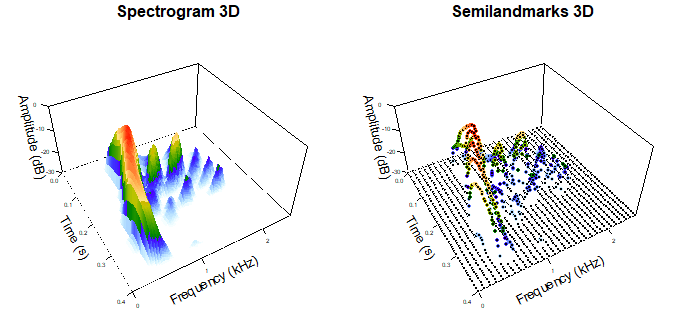

**Figure 1:** Graphical outputs using `threeDspectro` function from
`SoundShape` package: (left) 3D spectrogram and (right) points (*i.e.*
semilandmarks) sampled from 3D spectrogram data. `cuvieri` sample from
`SoundShape` package.

``` r
# Traditional oscillogram and spectrogram
par(mfrow=c(1,2), mar=c(4,4,2,1)) # view side by side
seewave::oscillo(cuvieri.cut, title="Oscillogram")
seewave::spectro(cuvieri.cut, flim=c(0, 2.5), grid=FALSE, scale=FALSE, main="Spectrogram")
```

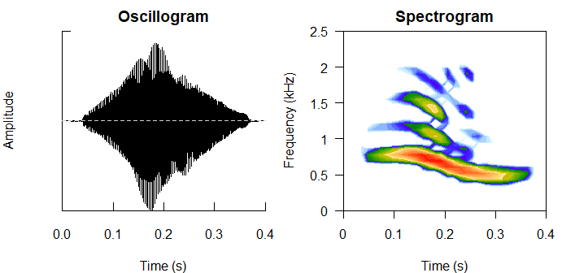

**Figure 2:** Graphical outputs using `seewave` package: (left)
Oscillogram created with `oscillo` function and (right) 2D spectrogram
created with `spectro` function. `cuvieri` sample from `SoundShape`
package.

## Installation

`SoundShape` package is currently available on [R
platform](https://www.r-project.org/) through the Comprehensive R
Archive Network (CRAN)
(<https://CRAN.R-project.org/package=SoundShape>). Alternatively, a
development version is available from [GitHub](https://github.com/)
(<https://github.com/p-rocha/SoundShape>).

The package can be installed using one of the following codes:

``` r
# Official version from CRAN (recommended):
install.packages("SoundShape")

# Development version from GitHub:
install.packages("devtools")
devtools::install_github("p-rocha/SoundShape")
```

## Citation

In case you wish to use and cite `SoundShape` package, use
`citation("SoundShape")`.

``` r
citation("SoundShape")
#> 
#> To cite package 'SoundShape' in publications use:
#> 
#>   Pedro Rocha (2021). SoundShape: Sound Waves Onto Morphometric Data. R
#>   package version 1.1.0. https://github.com/p-rocha/SoundShape
#> 
#> A BibTeX entry for LaTeX users is
#> 
#>   @Manual{,
#>     title = {SoundShape: Sound Waves Onto Morphometric Data},
#>     author = {Pedro Rocha},
#>     year = {2021},
#>     note = {R package version 1.1.0},
#>     url = {https://github.com/p-rocha/SoundShape},
#>   }
```

In addition, we recommend citing MacLeod et al. (2013) and Rocha &
Romano (2021):

  - MacLeod, N., Krieger, J., & Jones, K. E. (2013). Geometric
    morphometric approaches to acoustic signal analysis in mammalian
    biology. *Hystrix, the Italian Journal of Mammalogy, 24*(1),
    110-125. doi: 10.4404/hystrix-24.1-6299.

  - Rocha, P. & Romano, P. (2021) The shape of sound: A new R package
    that crosses the bridge between Bioacoustics and Geometric
    Morphometrics. *Methods in Ecology and Evolution, 00*, 1-7. doi:
    10.1111/2041-210X.13580

# Workflow using `SoundShape` package

## 1\. Definition of homologous acoustic units

Since eigensound is centered around stereotyped acoustic units, the
foremost step in sound shape study is the careful definition of units
from which analysis will be conducted. However, even though several
authors argue that acoustic traits constrained by anatomical structures
(e.g. dominant frequency, pulse rate) are more conservative than those
under the direct influence of behaviour (e.g. call duration, interval
between calls), the criteria for homologous sound comparison may vary
across different animal groups (see Rocha & Romano, 2021, for examples
and more on homology between animal sounds). Therefore, we recommend a
throughout literature review before the definition of acoustic units.
Herein, we adopted a physiological definition of ‘note’, (McLister et
al., 1995; Robillard et al., 2006), which led to an unambiguous
selection of stereotyped calls from three frog species: *Physalaemus
centralis*, *P. cuvieri* and *P. kroyeri* (`centralis`, `cuvieri` and
`kroyeri` sample datas, respectively; Figs. 3 – 5).

``` r
# Samples of data from SoundShape package
data(cuvieri)
data(centralis)
data(kroyeri)

# Plot spectro from sample and highlight acoustic units

# centralis
seewave::spectro(centralis, flim = c(0, 4), wl=512, f=44100, ovlp=70, grid=FALSE)
graphics::abline(v=c(0.1, 0.8, 1.08, 1.78, 2.1, 2.8), lty=2)
```

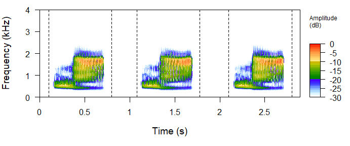

**Figure 3:** Spectrogram image of `centralis` sample (`SoundShape`
package), containing a sequence of three stereotyped vocalizations, each
representing a comparable acoustic unit.

``` r
# cuvieri
seewave::spectro(cuvieri, flim = c(0,4), wl=512, f=44100, ovlp=70, grid=FALSE)
graphics::abline(v=c(0.05, 0.45, 0.73, 1.13, 1.47, 1.87), lty=2)
```

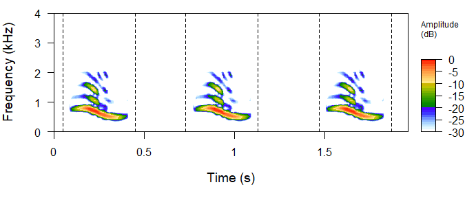

**Figure 4:** Spectrogram image of `cuvieri` sample (`SoundShape`
package), containing a sequence of three stereotyped vocalizations, each
representing a comparable acoustic unit.

``` r
# kroyeri
seewave::spectro(kroyeri, flim = c(0, 4), wl=512, f=44100, ovlp=70, grid=FALSE)
graphics::abline(v=c(0.16, 0.96, 1.55, 2.35, 2.9, 3.8), lty=2)
```

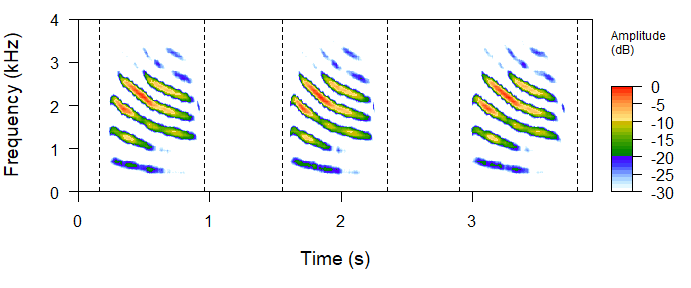

**Figure 5:** Spectrogram image of `kroyeri` sample (`SoundShape`
package), containing a sequence of three stereotyped vocalizations, each
representing a comparable acoustic unit.

## 2\. Create folder to store acoustic units

The `eigensound` function (`SoundShape` package) focuses on the
acquisition of point coordinates (*i.e.* semilandmarks) from multiple
[Waveform Audio File Format](https://en.wikipedia.org/wiki/WAV) (WAV or
WAVE; `".wav"` file extensions), with each file representing a
comparable acoustic unit (see section 1). These `".wav"` files must be
stored on the same folder somewhere in your computer, which can be
created manually at your console and subsequently assigned as [working
directory in R](https://rdrr.io/r/base/getwd.html).

Alternatively, one can create the folder at *e.g.* the current working
directory using `dir.create`. Also create a subfolder to store the
upcoming outputs from `eigensound` function, as the following:

``` r
# Create a folder to store ".wav" files
wav.at <- file.path(getwd(), "Workflow sample")
dir.create(wav.at)

# Create subfolder to store results
store.at <- file.path(getwd(), "Workflow sample/output")
dir.create(store.at)
```

## 3\. Select and store acoustic units as separate `".wav"` files

A reasonable number of comparable acoustic units should be selected from
the sample and stored as new `".wav"` files on a folder from your
console (see section 2 for folder paths). Each file should represent a
single unit selected from the original sound wave.

Since the slightest graphical change may incur in biased results
(MacLeod et al., 2013; Rocha & Romano, 2021), acoustic units must be
selected according to optimal signal to noise ratio (*i.e.* “clean”
recording), and no overlapping frequencies from other individuals,
species, or background noise. Editing and filtering of sound waves must
be restricted to a bare minimum.

The selection can be performed on numerous softwares of acoustic
analysis outside `R` platform (*e.g.*
[Audacity](https://www.audacityteam.org/), [Raven
Pro](http://ravensoundsoftware.com/software/raven-pro/)), or using some
functions from [seewave](https://CRAN.R-project.org/package=seewave) and
[tuneR](https://CRAN.R-project.org/package=tuneR) packages as
exemplified below:

``` r
# Select acoustic units
cut.centralis <- seewave::cutw(centralis, f=44100, from=0, to=0.9, output = "Wave")
cut.cuvieri <- seewave::cutw(cuvieri, f=44100, from=0, to=0.9, output = "Wave")
cut.kroyeri <- seewave::cutw(kroyeri, f=44100, from=0.2, to=1.1, output = "Wave")
```

``` r
# Export ".wav" files containing acoustic units and store on previosly created folder
writeWave(cut.cuvieri, filename = file.path(wav.at, "cut.cuvieri.wav"), extensible = FALSE)
writeWave(cut.centralis, filename = file.path(wav.at, "cut.centralis.wav"), extensible = FALSE)
writeWave(cut.kroyeri, filename = file.path(wav.at, "cut.kroyeri.wav"), extensible = FALSE)
```

## 4\. Three steps that avoid errors and biased results

The semilandmarks from `eigensound` function (`SoundShape` package) are
automatically acquired, meaning that this approach does not add human
errors from LM digitalization. Despite that, the eigensound protocol
(MacLeod et al., 2013) requires some standardization to `".wav"` files
that would otherwise lead to errors or biased results (*e.g.* sounds
overlapping the edges of a sound window; units far from the beginning of
sound window; a low signal to noise ratio; Rocha & Romano, 2021).

In light of this, Rocha & Romano (2021) proposed the following steps
that prevent errors and biased results, which are aided by the functions
`align.wave` and `eigensound` (with `analysis.type = "twoDshape"`), both
from `SoundShape` package.

### 4.1 Define dimensions for the sound window

First, define the sound window dimensions that encompass the whole
sample of acoustic units. These dimensions are represented by the time
(*x*-axis) and frequency (*y*-axis) limits for spectrogram images, which
are respectively defined by the `tlim` and `flim` arguments in
`eigensound` function.

Time limits should be based on the acoustic unit with the longest
duration within the sample, whereas frequency limits should consider the
unit with the largest frequency bandwidth. In the present sample study,
for instance, the longest units are also the ones with broader frequency
bandwidths (*i.e.* `kroyeri` sample; Fig. 6), with approximately 0.7 s
duration and highest frequencies close to 3.5 kHz. Therefore, the sound
window dimensions that encompass the whole sample can be defined with
`tlim = c(0, 0.8)` and `flim = c(0, 4)`.

This can be exemplified using `spectro` function from `seewave` package:

``` r
# Spectrogram plots using standardized sound window dimensions
par(mfrow=c(2,2), mar=c(4,4,2,2))
seewave::spectro(cut.centralis, flim=c(0, 4), tlim=c(0, 0.8), main="data(centralis)",
                 wl=512, f=44100, ovlp=70, grid=FALSE, scale=FALSE)
seewave::spectro(cut.cuvieri, flim=c(0, 4), tlim=c(0, 0.8), main="data(cuvieri)", 
                 wl=512, f=44100, ovlp=70, grid=FALSE, scale=FALSE)
seewave::spectro(cut.kroyeri, flim=c(0, 4), tlim=c(0, 0.8), main="data(kroyeri)", 
                 wl=512, f=44100, ovlp=70, grid=FALSE, scale=FALSE)
```

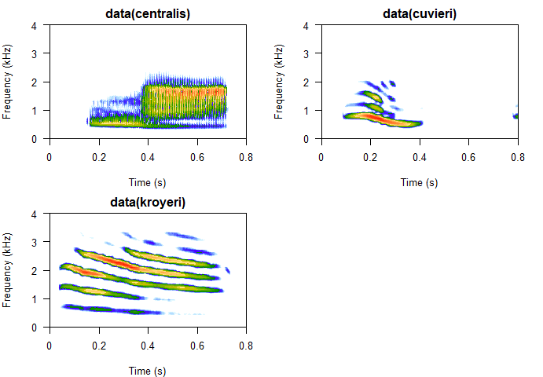

**Figure 6:** Spectrogram images with standardized sound window
dimensions.

### 4.2 Alignment of acoustic units at the beginning of a sound window

The eigensound protocol also requires acoustic units to be placed at the
beginning of a sound window before proceeding with the analysis. This
ensures that variation in each semilandmark is due to energy shifts
within the call, not to changes in their relative position in the sound
window (MacLeod et al., 2013).

Although this arbitrary alignment could be performed on numerous
software of acoustic analysis outside `R` platform (*e.g.*
[Audacity](https://www.audacityteam.org/), [Raven
Pro](http://ravensoundsoftware.com/software/raven-pro/)), `align.wave`
function (`SoundShape` package) provide an easy alternative to
automatically align the units at the beginning of a sound window whilst
also standardizing the durations of `".wav"` files (see section 4.1),
thus preventing errors when running `eigensound` function.

In order to verify the alignment, run `eigensound` with `analysis.type =
"twoDshape"` and `plot.exp = TRUE`, which will create 2D spectrogram
images and store them on the folder specified by `store.at` (see section
2 for folder paths), a helpful option for the verification of
appropriate alignment and sound window dimensions.

Below is the code employed for the alignment of sound units and
verification of sound window dimensions:

``` r
# Place sounds at the beginning of a sound window
align.wave(wav.at=wav.at, wav.to="Aligned", time.length = 0.8)

# Verify alignment using analysis.type = "twoDshape"
eigensound(analysis.type = "twoDshape", wav.at = file.path(wav.at, "Aligned"),
           store.at=store.at, plot.exp=TRUE, flim=c(0, 4), tlim=c(0, 0.8))

# Go to folder specified by store.at and check jpeg files created
```

If either the alignment, or the sound window dimensions, are not ideal
(*e.g.* units far from the beginning of sound window; sounds overlapping
the edges of sound window), run `align.wave` with different values of
`time.length` and/or `time.perc`, then use `eigensound` to verify the
updated spectrogram outputs (see Rocha & Romano, 2021 for details).

The ideal window dimensions and the alignment of units are often
achieved after a few attempts. If this is troublesome, consider
revisiting the relative amplitude (`dBlevel`) as the background noise
could be interfering with `align.wave` (see section 4.3).

### 4.3 Set relative amplitude background

Next is the definition of a relative amplitude value (`dBlevel`) to be
used as background in the 3D spectrogram (MacLeod et al., 2013). This is
an iterative process that can be implemented by `eigensound` with
`analysis.type = "twoDshape"` and `plot.exp = TRUE`, and should lead to
spectrogram images with minimum influence from background noise (Rocha &
Romano, 2021).

In the present study sample, the curve of relative amplitude was set at
-25 dB (Fig. 5), which is expressed as an absolute value for `dBlevel`
arguments in `SoundShape` functions (*i.e.* `dBlevel = 25`).

The code below was used to create the graphs from Fig. 7:

``` r
# 2D spectrogram with curves of relative amplitude at -25 dB
par(mfrow=c(1,2), mar=c(4,4,1,1))
s.kro <- seewave::spectro(cut.kroyeri, flim=c(0, 4), tlim = c(0, 0.8),  
                          grid=F, scale=F, f=44100, wl=512, ovlp=70, cont=TRUE, 
                          contlevels = seq(-25, -25, 1), collevels = seq(-40, 0, 0.1))
#> This took quite a lot of time to display this graphic, you may set 'fastdisp=TRUE' for a faster, but less accurate, display

# 3D spectrogram (with a lower dBlevel for illustrative purpuses)
threeDspectro(cut.kroyeri, dBlevel=40, flim=c(0, 4), tlim=c(0, 0.8), main="",
              colkey=list(plot=FALSE), cex.axis=0.4, cex.lab=0.8, resfac=2)

# Set background at -40 dB and remove -Inf values from spectrogram data 
for(i in 1:length(s.kro$amp)){if(s.kro$amp[i] == -Inf |s.kro$amp[i] <= -40)
{s.kro$amp[i] <- -40}}

# Add curve of relative amplitude
plot3D::contour3D(x=s.kro$time, y=s.kro$freq, colvar=t(s.kro$amp), z=-25,
                  plot=T, add=T, addbox=F, col="black", lwd=1.9, nlevels=2, dDepth=0.25)
```

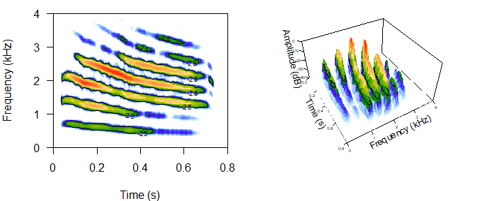

**Figure 7:** 2D and 3D spectrograms (left and right, respectively) with
relative amplitude contours highlighted by black lines (`dBlevel = 25`).
Spectrogram images from `kroyeri` sample.

## 5\. Define sampling grid and run `eigensound`

After concluding the three steps that avoid errors and biased results
(section 4), next is the definition of sampling grid dimensions that
will be used for semilandmark acquisition (*i.e.* number of cells per
side; `x.length` and `y.length` arguments, `eigensound` function; Fig.
8).

The number of cells per side will determine the amount of sLM acquired
by eigensound. Therefore, the ideal grid should adequate the sound
sample, while also representing a dimensionality reduction from
spectrogram data (see Rocha & Romano, 2021). Herein, we opted for 70
cells on the time (*x*-axis, `x.length = 70`) and 47 cells on the
frequency (*y*-axis, `y.length = 47`), which was experimentally defined
with the aid of `threeDspectro` function, as exemplified below:

``` r
# Using threeDspectro to visualize sampling grid 
par(mfrow=c(1,2), mar=c(1,2,1,0)) 

# As "surface"
threeDspectro(cut.kroyeri, samp.grid=TRUE, x.length=70, y.length=47, plot.type="surface", 
              dBlevel=25, flim=c(0, 4), tlim=c(0, 0.8), f=44100, wl=512, ovlp=70, main="As 'surface'",
              colkey=list(plot=FALSE), cex.axis=0.4, cex.lab=0.8)

# As "points"
threeDspectro(cut.kroyeri, samp.grid=TRUE, x.length=70, y.length=47, plot.type="points", 
              dBlevel=25, flim=c(0, 4), tlim=c(0, 0.8), f=44100, wl=512, ovlp=70, main="As 'points'",
              colkey=list(plot=FALSE), cex.axis=0.4, cex.lab=0.8)
```

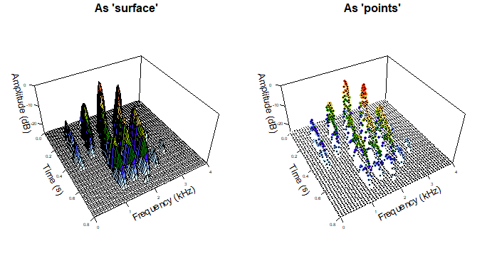

**Figure 8:** Spectrogram data as (left) simplified surface, and (right)
colored semilandmarks acquired from the intersections of sampling grid
(*i.e.* `x.length=70` and `y.length=47`). Spectrogram images from
`kroyeri` sample.

### 5.1 Run `eigensound` function

Once the three steps that avoid errors are concluded (section 4) and the
sampling grid is defined (see above), it is now possible to acquire
comparable semilandmark coordinates using `eigensound` function with
`analysis.type = "threeDshape"`.

Results can be simultaneosly assigned to an `R` object, and/or stored as
the native file format of TPS series
([Rohlf, 2015](http://www.italian-journal-of-mammalogy.it/The-tps-series-of-software,77186,0,2.html)),
a `".tps"` file to be used by numerous software of geometric analysis of
shape. Here, we focus on the analysis within `R` platform, so the
results are assigned to the `R` object `eig.sample`, which is available
as sample data from `SoundShape`.

**Note:** `eig.sample` comprises all vocalizations present in the
samples of `centralis`, `cuvieri` and `kroyeri`, which led to three
acoustic units per species; a total of nine `".wav"` files stored in the
same folder. Use `help(eig.sample)` and check Rocha & Romano (2021) for
details.

In the following code, `eigensound` is run with a logarithmic scale on
the time axis (*i.e.* `log.scale = TRUE`; see Rocha & Romano, 2021):

``` r
# Sample semilandmarks for each ".wav" file on a folder using a logarithmic sampling grid
# Export 3D graphs with semilandmarks as colored points for inspection
eig.sample <- eigensound(analysis.type="threeDshape", dBlevel=25, 
                         f=44100, wl=512, ovlp=70, flim=c(0, 4), tlim=c(0, 0.8),
                         x.length=70, y.length=47, log.scale=TRUE, plot.exp=TRUE, plot.type="points",
                         wav.at=file.path(wav.at, "Aligned"), store.at=store.at)

# Go to folder specified by store.at and check jpeg files created
```

## 6\. Principal Components Analysis

After employing a sampling grid to acquire semilandmarks from sound
waves (section 5), the eigensound protocol proceeds to a dimensionality
reduction procedure that facilitate comparison of sound shape data.
Herein, we opted for a Principal Components Analysis (PCA), which allow
complex sound waves to be described and plotted onto major axes (PCs)
encompassing the majority of variance within the sample (MacLeod et al.,
2013; Rocha & Romano, 2021).

The PCA can be performed using `prcomp` function (`stats` package), as
exemplified below:

``` r
# PCA using three-dimensional semilandmark coordinates embeeded in eig.sample
pca.eig.sample <- stats::prcomp(geomorph::two.d.array(eig.sample))

# View summary results
summary(pca.eig.sample)
#> Importance of components:
#>                             PC1      PC2      PC3      PC4      PC5     PC6
#> Standard deviation     125.0412 101.4575 39.39182 29.97205 17.11317 14.5307
#> Proportion of Variance   0.5407   0.3560  0.05367  0.03107  0.01013  0.0073
#> Cumulative Proportion    0.5407   0.8967  0.95041  0.98148  0.99161  0.9989
#>                            PC7     PC8       PC9
#> Standard deviation     4.95910 2.63948 5.762e-14
#> Proportion of Variance 0.00085 0.00024 0.000e+00
#> Cumulative Proportion  0.99976 1.00000 1.000e+00
```

**Note:** At this point, consider employing a stopping rule to select
which PCs should be retained as nontrivial and interpretable, and which
ones should be ignored (*e.g.* broken stick models,
[vegan](https://CRAN.R-project.org/package=vegan) package) (Jackson,
1993; see Rocha & Romano, 2021 for details).

### 6.1 Hypothetical sound shape configurations from semilandmark data

Before proceeding to the ordination of Principal Components (PCs), the
eigensound protocol also includes hypothetical sound surfaces to be
interpreted along with the ordination plots (MacLeod et al., 2013).
These surfaces are calculated using `hypo.surf` function and should be
interpreted along with the ordination plots, enhancing the comprehension
of how sound shape changed along with each PCs

In `SoundShape` package, the hypothetical sound shapes can be created
using `hypo.surf` function, which enables the calculation of either the
mean shape configuration from the sample (*i.e.* consensus shape;
Zelditch et al., 2012), or minimum and maximum deformations relative to
PCs, as exemplified below:

``` r
# Create hypothetical sound surfaces using hypo.surf

# Mean shape configuration (consensus)
hypo.surf(eig.sample,  PC="mean", flim=c(0, 4), tlim=c(0, 0.8), x.length=70, y.length=47,
          cex.lab=0.7, cex.axis=0.5, cex.main=1)
```

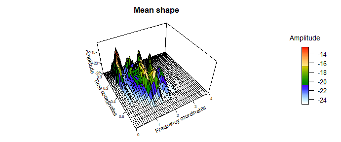

**Figure 9:** Hypothetical sound surface (acquired using `hypo.surf`
function) representing mean shape configuration from `eig.sample` sample
of data.

``` r
# Minimum and maximum deformations - Principal Component 1
hypo.surf(eig.sample, PC=1, flim=c(0, 4), tlim=c(0, 0.8), x.length=70, y.length=47,
          cex.lab=0.7, cex.axis=0.5, cex.main=1)
```

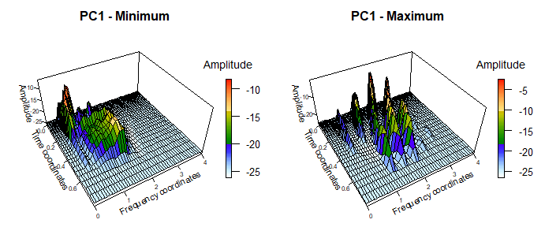

**Figure 10:** Hypothetical sound surfaces (acquired using `hypo.surf`
function) representing minimum and maximum deformations relative to PC1
in the PCA featuring `eig.sample` sample of data.

``` r
# Minimum and maximum deformations - Principal Component 2
hypo.surf(eig.sample, PC=2, flim=c(0, 4), tlim=c(0, 0.8), x.length=70, y.length=47,
          cex.lab=0.7, cex.axis=0.5, cex.main=1)
```

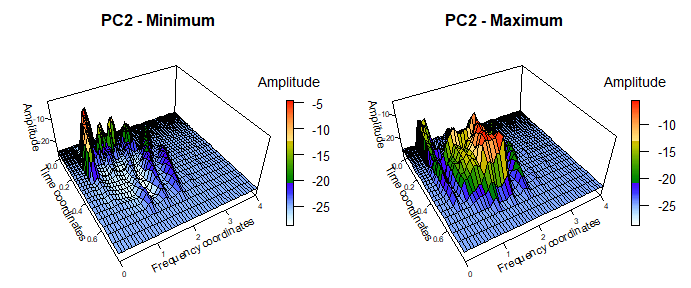

**Figure 11:** Hypothetical sound surfaces (acquired using `hypo.surf`
function) representing minimum and maximum deformations relative to PC2
in the PCA featuring `eig.sample` sample of data.

### 6.2 Ordination plot with `pca.plot` function

Among the benefits of employing a PCA on multivariate data is the
possibility to generate ordination plots encompassing the majority of
variation embedded in the sample (Fig. 12). These plots simplify
description and are widely employed in exploratory data analysis,
specially when one is looking for potential groups within the sample
(Zelditch et al. 2012).

The ordination plot is facilitated by `pca.plot` function (`SoundShape`
package), which require the output of a PCA performed by `prcomp`
function (`stats` package) and a vector with `groups` to be colored.

The code chunk below exemplifies how create an ordination plot using
`pca.plot`:

``` r
# PCA using semilandmark coordinates
pca.eig.sample <- stats::prcomp(geomorph::two.d.array(eig.sample))

# Verify names of acoustic units from sample 
dimnames(eig.sample)[[3]]
#> [1] "cut.cent1" "cut.cent2" "cut.cent3" "cut.cuv1"  "cut.cuv2"  "cut.cuv3" 
#> [7] "cut.kro1"  "cut.kro2"  "cut.kro3"

# Based on those names, create factor to use as groups in subsequent ordination plot
sample.gr <- factor(c(rep("centralis", 3), rep("cuvieri", 3), rep("kroyeri", 3)))

# Ordination plot
pca.plot(pca.eig.sample, groups=sample.gr, conv.hulls=sample.gr, leg.pos="bottomright", cex=1.2)
```

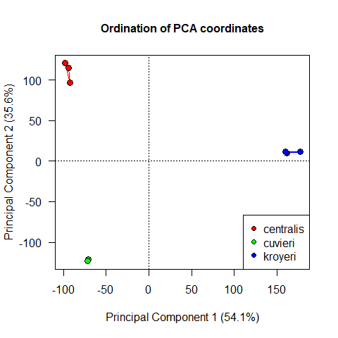

**Figure 12:** Ordination plot using `eig.sample` data acquired from the
samples of `centralis`, `cuvieri` and `kroyeri`.

## 7\. Interpreting the outputs of `SoundShape`

In order to fully comprehend how sound shape changes along the studied
sample, the PCA outcome should be interpreted along with the
visualization of hypothetical sound shapes (Figs. 9 – 11) and the
ordination plot (Fig. 12).

The ordination plot (Fig. 12) represent 89.7% of the whole variance in
our dataset, which yielded a clear structuring of units from different
species. In addition, the hypothetical sound surfaces from the main axis
of variation (*i.e.* mean shape and PCs) clearly represented the sound
shapes of acoustic units employed in the study.

The higher positive values of PC1, for instance, corresponded to
acoustic units with clear harmonic structure and broad frequency
bandwidth (Fig. 10), a hypothetical sound shape remarkably similar to
three-dimensional spectrograms from `kroyeri` sample. Not coincidently,
the units from `kroyeri` scored high positive PC1 values. Lower and
negative values of PC1, on the other hand, were less obvious, with a
hypothetical shape that gather sonic information from `cuvieri` and
`centralis` samples, both species with negative PC1 scores. A similar
pattern is observed in PC2 axis (Fig. 11), with positive PC2 values
referring to broad frequency bandwidth and no harmonic structure (*i.e.*
`centralis` sample), and negative PC2 values representing short
durations and clear harmonic structure (*i.e.* `cuvieri` sample).

## References

Jackson, D. A. (1993). Stopping rules in Principal Components Analysis:
A comparison of heuristical and statistical approaches. *Ecology,
74*(8), 2204-2214.

MacLeod, N., Krieger, J. & Jones, K. E. (2013). Geometric morphometric
approaches to acoustic signal analysis in mammalian biology. *Hystrix,
the Italian Journal of Mammalogy, 24*(1), 110-125. doi:
10.4404/hystrix-24.1-6299

McLister, J. D., Stevens, E. D., & Bogart, J. P. (1995). Comparative
contractile dynamics of calling and locomotor muscles in three hylid
frogs. *The Journal of Experimental Biology, 198*, 1527-1538.

Robillard, T., Hobel, G., & Gerhardt, H. C. (2006). Evolution of
advertisement signals in North American hylid frogs: vocalizations as
end-products of calling behavior. *Cladistics, 22*(6), 533-545. doi:
10.1111/j.1096-0031.2006.00118.x

Rocha, P. & Romano, P. (2021) The shape of sound: A new R package that
crosses the bridge between Bioacoustics and Geometric Morphometrics.
*Methods in Ecology and Evolution, 00*, 1-7. doi:
10.1111/2041-210X.13580

Rohlf, F.J. (2015) The tps series of software. *Hystrix 26*, 9-12.

Zelditch, M. L., Swiderski, D. L., Sheets, H. D., & Fink, W. L. (2012).
*Geometric morphometrics for biologists: A primer*. Elsevier (Second
Edition). Elsevier, San Diego.
